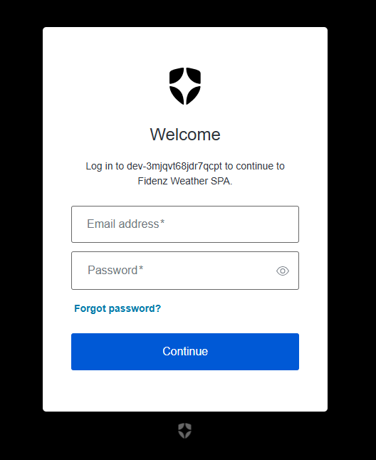
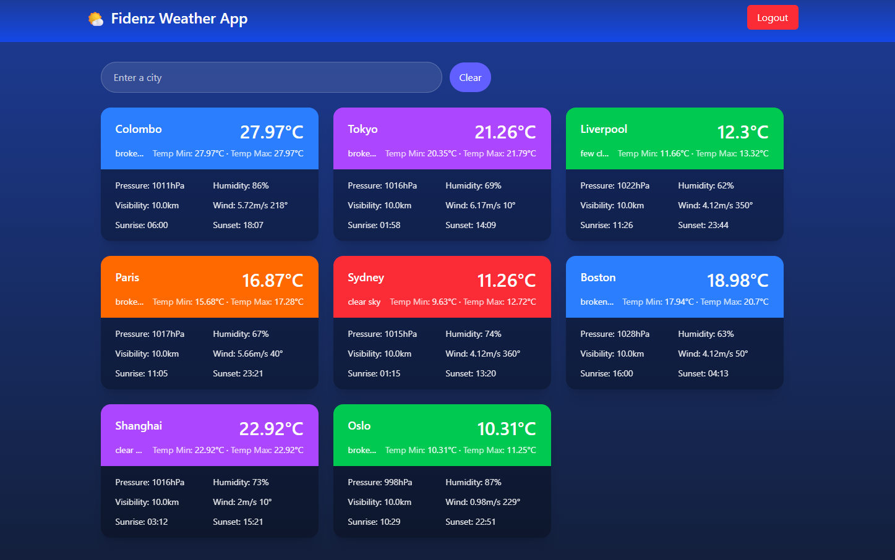
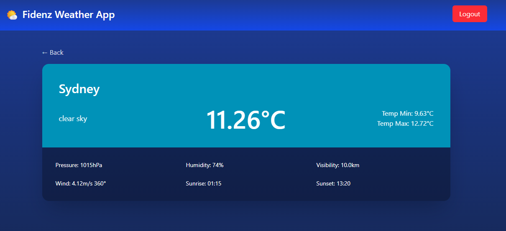

# Fidenz Weather App

A secure, full‑stack weather application built for the Fidenz Technologies assignment. It consists of a Spring Boot (Java 21) backend that fetches current weather from OpenWeatherMap and a React + Vite + TypeScript frontend secured with Auth0. Caching is implemented with Caffeine to reduce API calls.

## Monorepo structure

```
.
├─ fidenz-backend/
│  └─ fidenz-weather-app/           # Spring Boot 3 app (Java 21)
│     ├─ src/main/java/com/fidenz/assignment/fidenz_weather_app
│     │  ├─ config/                 # Security, caching, RestTemplate, exception handling
│     │  ├─ controller/             # WeatherController (REST endpoints)
│     │  ├─ model/                  # WeatherResponse DTO
│     │  └─ service/                # WeatherService (OpenWeatherMap calls)
│     ├─ src/main/resources/
│     │  ├─ application.properties  # Uses env/.env via spring-dotenv
│     │  └─ cities.json             # Seed list of city codes
│     └─ pom.xml
└─ fidenz-frontend/
   └─ frontend/                     # React + Vite + TS + Tailwind
      ├─ src/
      │  ├─ api/weatherApi.ts       # Axios instance w/ Auth0 bearer token
      │  ├─ auth/AuthProvider.tsx   # Auth0 provider wiring (RBAC scopes)
      │  ├─ components/             # Navbar, WeatherCard
      │  ├─ pages/                  # Dashboard (grid), CityDetail (details page)
      │  └─ config.ts               # Frontend env config
      ├─ index.html, vite.config.ts, package.json
      └─ eslint.config.js
```

## Features

- Secure REST API with OAuth2/JWT (Auth0 as the provider)
- Role/scope-based access control: requires scope `read:weather`
- Weather by city (OpenWeatherMap) with 5-minute in-memory caching (Caffeine)
- React dashboard to view/search cities and drill down to a city details page
- Graceful error handling on the API; structured error payloads
- Strict CORS configuration (backend → `frontend.origin`)

## Screenshots
- Login Page

  

- Dashboard

  

- City Detail

  

## Tech stack

- Backend: Spring Boot 3, Java 21, Spring Security (Resource Server), Caffeine cache, RestTemplate, org.json, spring-dotenv
- Frontend: React 19, Vite 7, TypeScript 5, Tailwind CSS, Auth0 React SDK, Axios, React Router

## Prerequisites

- Java 21
- Maven (or use the included Maven Wrapper)
- Node.js 18+ and npm
- Auth0 tenant (SPA + API with RBAC enabled)
- OpenWeatherMap API Key

## Configuration (Environment)

Both apps are configured via environment variables. The backend additionally supports a `.env` file (thanks to `spring-dotenv`).

### Backend env (.env in `fidenz-backend/fidenz-weather-app/`)

- `api_key` — OpenWeatherMap API key
- `url` — OpenWeatherMap current weather endpoint (default recommended: `https://api.openweathermap.org/data/2.5/weather`)
- `frontend_origin` — Frontend origin for CORS (e.g., `http://localhost:5173`)
- `issuer` — Auth0 issuer URL (e.g., `https://YOUR_TENANT.us.auth0.com/` with trailing slash)
- `audience` — Auth0 API identifier (must match the API you create in Auth0)

These map to `application.properties`:

```
spring.application.name=fidenz-weather-app
server.port=8080

openweathermap.api.key=${api_key}
openweathermap.api.url=${url}

spring.cache.type=caffeine
frontend.origin=${frontend_origin}

spring.security.oauth2.resourceserver.jwt.issuer-uri=${issuer}
spring.security.oauth2.resourceserver.jwt.audience=${audience}
```

### Frontend env (.env in `fidenz-frontend/frontend/`)

- `VITE_API_BASE_URL` — API base URL (default: `http://localhost:8080/api`)
- `VITE_AUTH0_DOMAIN` — Auth0 domain (bare domain only, e.g., `dev-xxxx.us.auth0.com`)
- `VITE_AUTH0_CLIENT_ID` — Auth0 SPA Client ID
- `VITE_AUTH0_AUDIENCE` — Auth0 API identifier (same value as backend `audience`)
- `VITE_AUTH0_SCOPE` — Default: `openid profile email read:weather`
- `VITE_AUTH0_REDIRECT_URI` — Optional; default uses `window.location.origin`

Notes:
- The frontend will refuse to start properly if `VITE_AUTH0_DOMAIN` or `VITE_AUTH0_CLIENT_ID` are missing.
- `VITE_AUTH0_DOMAIN` must be a domain only (no protocol or slashes).

## Auth0 setup

1) Create an API in Auth0
- Identifier: e.g., `https://fidenz-weather-api` (use this as `audience` in both apps)
- Enable RBAC and “Add Permissions in the Access Token”
- Create a permission/scope: `read:weather`

2) Create a SPA Application in Auth0
- Allowed Callback URLs: `http://localhost:5173`
- Allowed Logout URLs: `http://localhost:5173`
- Allowed Web Origins: `http://localhost:5173`
- Assign the API permission `read:weather` to your user (or via a role) so it appears in the token.

Backend accepts authorities from both `scope` and `permissions` claims, mapping them to `SCOPE_*` internally.

## Running locally (Windows PowerShell examples)

Backend (in `fidenz-backend/fidenz-weather-app/`):

- Create `.env` with the variables shown above
- Start with Maven Wrapper:
  - Development run: `./mvnw.cmd spring-boot:run`
  - Or build a jar: `./mvnw.cmd clean package` then run `java -jar target/fidenz-weather-app-0.0.1-SNAPSHOT.jar`

Frontend (in `fidenz-frontend/frontend/`):

- Create `.env` with the variables shown above
- Install deps: `npm install`
- Start dev server: `npm run dev` (Vite defaults to `http://localhost:5173`)

Ensure backend `frontend_origin` matches the dev server origin exactly.

## API reference

Base URL: `${VITE_API_BASE_URL}` (defaults to `http://localhost:8080/api`)

Security: Bearer token (Auth0) with scope `read:weather`

- GET `/weather`
  - Returns: `WeatherResponse[]` for all cities from `cities.json`
- GET `/weather/{cityId}`
  - Returns: `WeatherResponse` for the requested city

`WeatherResponse` shape:

```
{
  "cityID": "1248991",
  "cityName": "Colombo",
  "description": "broken clouds",
  "temperature": 30.5,
  "tempMin": 29.0,
  "tempMax": 32.0,
  "pressure": 1012,
  "humidity": 70,
  "visibility": 10000,
  "windSpeed": 4.12,
  "windDegree": 240,
  "sunrise": 1726890210,
  "sunset": 1726933899
}
```

Error responses (examples):

- 400 Bad Request — e.g., missing OWM API key: `{ "error": "bad_request", "message": "..." }`
- 401 Unauthorized — missing/invalid token or scope
- 500 Server Error — upstream/API failure: `{ "error": "server_error", "message": "..." }`

## Caching

- Caffeine in-memory cache for 5 minutes per city id (`@Cacheable("weather")`)
- Reduces OpenWeatherMap calls while keeping data sufficiently fresh for a dashboard use-case

## Cities seed data

- `src/main/resources/cities.json` contains the default list of city codes
- To add/remove cities shown in the dashboard, edit this file and rebuild/restart the backend

## Development tips

- If you get CORS errors, verify `frontend_origin` matches the exact origin reported by the browser (protocol, host, and port)
- If Auth0 login loops or 401s:
  - Confirm `VITE_AUTH0_DOMAIN`, `VITE_AUTH0_CLIENT_ID`, and `VITE_AUTH0_AUDIENCE`
  - Ensure your user has the `read:weather` permission and RBAC is enabled
  - Backend `issuer` must be the full issuer URL with a trailing slash
- If weather calls fail, confirm `api_key` and `url` are correct and reachable from the backend

## Build & production

- Backend: `mvn clean package` produces `target/fidenz-weather-app-0.0.1-SNAPSHOT.jar`
  - Required environment variables at runtime: `api_key`, `url`, `issuer`, `audience`, `frontend_origin`
- Frontend: `npm run build` generates a production build in `dist/`
  - Serve behind a static web server (e.g., Nginx). Set `VITE_*` at build time (they’re baked into the bundle).

## Notes for reviewers

- Security: method-level authorization in `WeatherController` (`@PreAuthorize("hasAuthority('SCOPE_read:weather')")`), JWT audience/issuer validation, and strict CORS
- Code quality: small, modular structure with clear separation of concerns and typed frontend models
- UX: minimal and focused—searchable dashboard grid and a per‑city detail page
- Extensibility: add more endpoints (e.g., forecast) or providers; adjust cache TTL in `CacheConfig`

## License

This codebase is provided for evaluation as part of an assignment.
